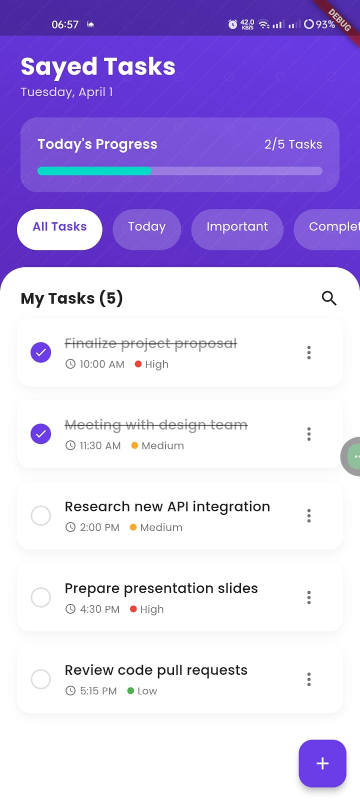
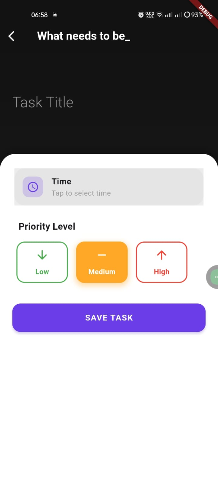

# TaskMaster - Flutter Task Manager 🚀


A modern task management app built with Flutter and Provider state management. Organize tasks with priorities, deadlines, and progress tracking.

<p align="center">
  
  
  
</p>

## Features ✨
- ✅ Create/Edit/Delete tasks
- 🚨 Priority levels (High/Medium/Low)
- ⏰ Time scheduling with intuitive picker
- 📊 Progress tracking dashboard
- 📱 Responsive UI for all screen sizes

## Installation 🛠️
1. Clone the repository:
   ```bash
   git clone https://github.com/sayedyounis00/Mhamy.git
